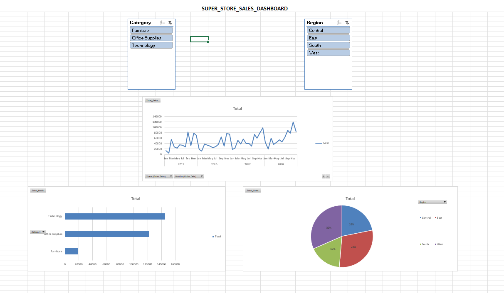
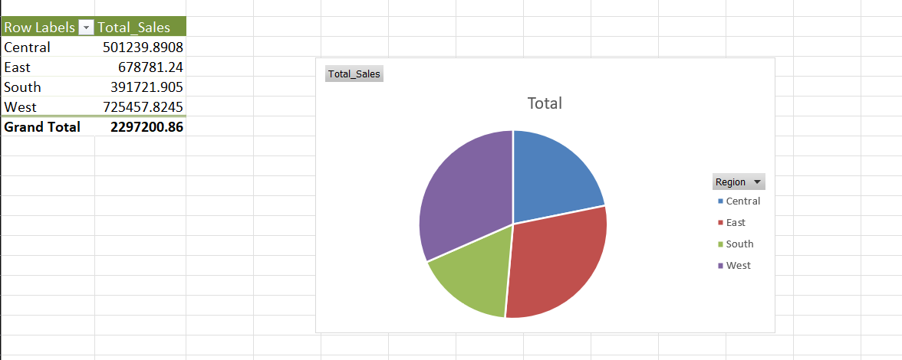
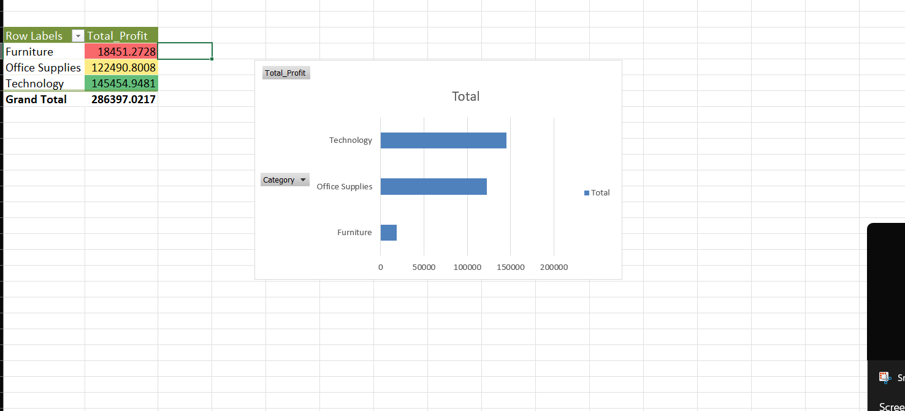
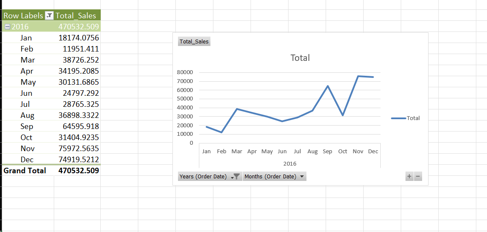

#  Excel Sales Dashboard

This project is an interactive Sales Dashboard built using Microsoft Excel, based on the Superstore dataset. It focuses on turning raw data into clear and meaningful business insights.

---

##  Project Overview
In this project, I analyzed sales data using Excel tools like Pivot Tables, charts, and slicers. The goal was to understand sales performance across regions, categories, and time, and present it in a simple and visual way.

---

## 📸 Dashboard Preview

---

##  Key Visuals

###  Sales by Region

###  Profit by Category

###  Sales Trend

---

##  Tools & Techniques Used
- Microsoft Excel  
- Pivot Tables  
- Pivot Charts (Bar, Pie, Line)  
- Data grouping (monthly trends)  
- Conditional formatting  
- Slicers for interactivity  

---

##  Key Insights
- West and East regions show higher sales performance  
- Technology category generates the highest profit  
- Sales vary across months, indicating seasonal trends  
- Some regions and categories have scope for improvement  

---

##  Files Included
- Sample_Superstore.xlsm  
- Dashboard screenshots  

---

##  Conclusion
This dashboard helped me understand how to transform raw data into a clear and interactive report. It highlights key patterns in sales and supports better decision-making.

---

